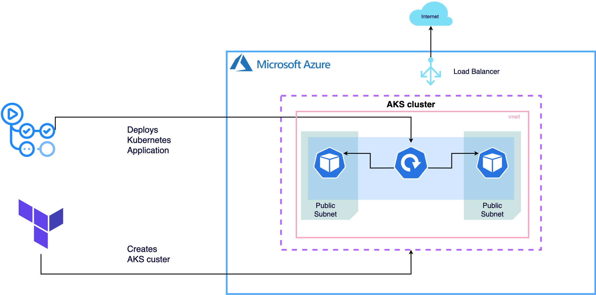

# DoU University Final Project

## Stack
- Kubernetes  
A portable, extensible, open-source platform for managing containerized workloads and services.
- GitHub Actions  
A GitHub feature that connects all of your tools to automate every step of your development workflow.
- Terraform  
It is an example of infraestructure as code (IaC).Terraform is a tool for building, changing, and versioning infrastructure safely and efficiently.
- Azure  
It is an example of a platform as a service (PaaS). It  is designed to support applications that are scalable, reliable, and inexpensive to operate.
- Ruby 2.4.2  
Ruby is an interpreted, high-level, general-purpose programming language.
- Database: PostgresSQL (supported by default), MariaDB or MySQL  
An organized collection of structured information, or data, typically stored electronically in a computer system.
- Reverse Proxy: Nginx (supported by default) or Apache  
These are popular web servers used to deliver web pages to a user's browser.

## Business Case
All companies need a way to handle all the requests and issues made by either their own employees or their costumers.  
Every organization inside the company has different requests, it can be from an employee asking for a new laptop to the IT Department, or it can be an employee asking Human Resources for a sick day.   
The number of requests and issues raised in each company can become too overwhelming, the company needs a way to deal with these requests in an efficient and organized way.   
**Zammad** is is a web-based, open source user support/ticketing solution. We found that Zammad offered a huge number of important features that can be found [here.](https://zammad.com/en/product/features)

## Justification

For our project, we needed to deploy Zammad with the help of Kubernetes, Terraform and a cloud provider like Azure.   
But why do we use kubernetes?  
First of all, Zammad uses containers containers can be a great wat to package and deploy services but when it's time to run these containers in production, we can end up with a huge number of containers, and all of these need to be managed, connected, deployed, etc.  
 A lot of developers would be needed to do all of this. This is when Kubernetes becomes an essential tool, kubernetes is basucally a container schedyler, it automates the deployment and management of all these containers. It saves thhe comapnies time and man hours.
Now, why use an IaC tool like terraform?  
With terraform we are able to create and destroy infraestructure very quickly, the efforts of creating and deleting the infraestructure we are using is reduced to a single command (plan and destroy).
And finally, why use Azure?  
The adavantages for migrating to clod are well [known](https://www.forbes.com/sites/forbestechcouncil/2021/03/12/why-migrate-to-the-cloud-the-basics-benefits-and-real-life-examples/), but why choose Azure?  
Azure supports a wide range of programming languages, frameworks, operating systems, databases and devices. Unlike other cloud services, Azure has an excellent documentation, which makes it easier for their costumers to understand what to do. Here are some other features:
- Scalability and Ductility
- Integrated Environment with other Microsoft tools
- Pay-as-you-go model
- Identity and Access Management


## How to run Zammad
## Prerequisites
- Have a Portal Azure Account
- Have a GitHub Account

### Steps

- **Install Terraform CLI in your local machine**

    [Install Terraform](https://learn.hashicorp.com/tutorials/terraform/install-cli)

- **Download Repository**

    ```
    git clone https://github.com/heber-crv/azure-terraform.git
    ```

- **Install Azure CLI**

    [Install Azure CLI ](https://docs.microsoft.com/en-us/cli/azure/install-azure-cli)

- **We must generate the permissions for our (app,code) to have access to azure, and we do this by creating a Service Principal**

    `az ad sp create-for-rbac --name "ServicePrincipalName" --role="Owner"`

     This command will output five values

     ```
          {
           "appId": "00000000-0000-0000-0000-000000000000",
           "displayName": "ServicePrincipalName",
           "name": "http://ServicePrincipalName",
           "password": "xxxxxxxx-xxxx-xxxx-xxxx-xxxxxxxxxxxx",
           "tenant": "00000000-0000-0000-0000-000000000000"
          }

    ```

    Arguments for service principal login can be derived from the output of its creation:
    
    __CLIENT_ID=appId__
    
    __CLIENT_SECRET=password__
    
    __TENANT_ID=tenant__


- **Terraform Code**

    We will create the `variable.tfvars` file to host the value of all the variables requiring

    *Note: Save the output values when creating the SP*

    the file should be like :

    ```
       subscription_id = "c4774376-bc4c-48e6-93eb-c0ac26c6345d"
       client_id       = "8390a98e-c29b-4219-bf02-725214d442d1"
       client_secret   = "k6c4j.-OcwCL59CKqssKddpulsVh-D4xU3"
       tenant_id       = "c8cd0425-e7b7-4f3d-9215-7e5fa3f439e8"
    ```


- **Terraform Commands**

    Now let's run the terraform commands to deploy the kubernetes cluster in azure 

   1. `terraform init` 
   
         This command performs several different initialization steps in order to prepare the current working directory for use with Terraform.
   1. `terraform validate`

        The terraform validate command validates the configuration files in a directory, referring only to the configuration and not accessing any remote services such as remote state, provider APIs, etc   

   1. `terraform plan`
   
        The terraform plan command creates an execution plan, which lets you preview the changes that Terraform plans to make to your infrastructure.

   1. `terraform apply`

- **Review the infrastructure created in Azure Portal**
    
    

### Deploy App in arquitecture Using Pipeline Github Actions

- **Download Repository**

    `Git clone https://github.com/heber-crv/azure-terraform.git`

- **Add credentials to Github and used to them in github actions**
 
    import credential to the github secret

    `settings>secrets>`
    
    

    *AZURE_CREDENTIALS*

    data :

    ```azurecli
     {
      "appId": "00000000-0000-0000-0000-000000000000",
      "displayName": "ServicePrincipalName",
      "name": "http://ServicePrincipalName",
      "password": "xxxxxxxx-xxxx-xxxx-xxxx-xxxxxxxxxxxx",
      "tenant": "00000000-0000-0000-0000-000000000000"
     }
    ```

    *DOCKER_PASSWORD*

    docker ID in dockerhub.

    *DOCKER_USERNAME*

    docker password in dockerhub.
    
- Create push in develop branch 

    This will activate the deploy of the system through github actions 

    

     When the pipeline has successfully completed it is time to connect to the cluster and get the service IP to view the application.

- **Connect to the Cluster**

    

    Commands

    `az account set --subscription your Subscription ID`

    `az aks get-credentials --resource-group your_rg --name cluster1`

- **Get the service IP**

    

    Command 

    `kubectl get svc`

    Now you will be able to view the Application by entering the IP in any browser.

    

## Diagrams
How does the project works? :

The infraestructure of the project:

## Costs
According to their [website](https://azure.microsoft.com/en-us/pricing/details/kubernetes-service/), 
>Azure Kubernetes Service (AKS) is a free container service that simplifies the deployment, management, and operations of Kubernetes as a fully managed Kubernetes container orchestrator service.

>Paying for only the virtual machines, and associated storage and networking resources consumed makes AKS the most efficient and cost-effective container service on the market.

You can explore their pricing options in the website provided.

The Terraform and GitHub features that we use in these project  are **free**.
